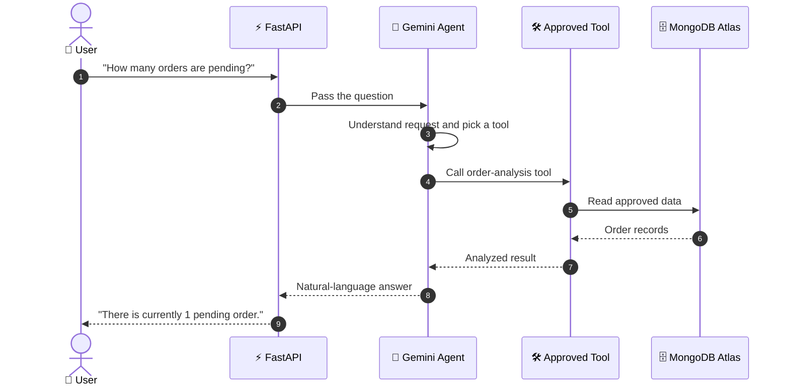
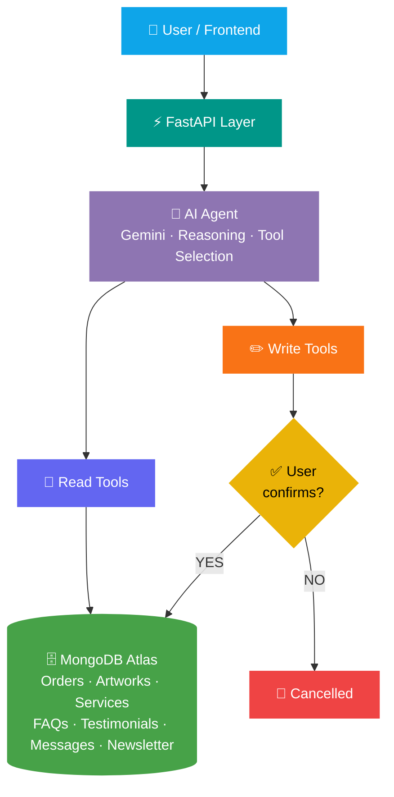
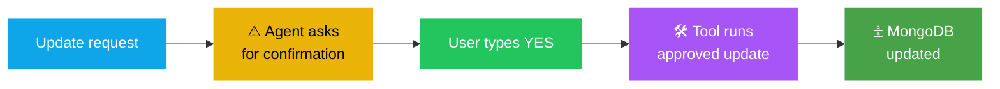
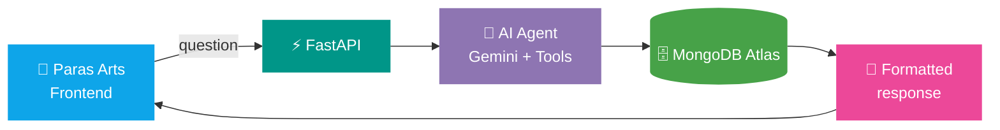

<!-- ═══════════════════════ HEADER ═══════════════════════ -->
<div align="center">


<!-- Animated terminal: the agent "thinking" -->


<br/>


<br/><br/>

<!-- ═══════════════════════ NAVIGATION ═══════════════════════ -->
<a href="#overview"></a>
<a href="#features"></a>
<a href="#how"></a>
<a href="#safety"></a>
<a href="#install"></a>

</div>


<!-- ═══════════════════════ OVERVIEW ═══════════════════════ -->
<a id="overview"></a>

## 🧠 Overview

The **Paras Arts AI Data Agent** is an AI-powered data analysis and business-intelligence agent. It is an intelligent extension of the **[Paras Arts](https://github.com/paraskosambe-web/paras-arts)** full-stack art portfolio and custom sketch ordering platform.

It connects an **AI reasoning layer (Google Gemini)** to approved business data in **MongoDB Atlas**. Instead of writing database queries, the artist simply asks a question in plain language, and the agent finds the data, analyzes it and answers.

> 💡 **In one line:** *You ask → the AI picks an approved tool → the tool reads the data → you get a clear answer.*

### 💬 See it in action

> 🧑 **You:** How many orders are currently pending?
>
> 🤖 **Agent:** There is currently 1 pending order.

> 🧑 **You:** What are the most common sketch types?
>
> 🤖 **Agent:** *Analyzes the order data and returns the distribution of sketch types.*

> 🧑 **You:** Give me a summary of the current business data.
>
> 🤖 **Agent:** *Combines order, payment, artwork and service data into a readable business summary.*

<details>
<summary><b>🎯 Why build this? (the problem it solves)</b></summary>
<br/>

The Paras Arts website holds many kinds of data: **orders, payments, artworks, services, FAQs, testimonials, customer messages and newsletter subscriptions**. Checking all of this by hand in the database is slow, and it needs technical knowledge.

This project gives the artist a **controlled AI interface** that can:

1. Understand natural-language requests
2. Identify the data needed
3. Retrieve the relevant information
4. Analyze it
5. Generate a meaningful response
6. Perform **only approved** database updates

</details>


<!-- ═══════════════════════ FEATURES ═══════════════════════ -->
<a id="features"></a>

## ✨ Agent Capabilities

<table>
<tr>
<td width="50%" valign="top">

### 🔎 Natural-Language Search
Ask about Paras Arts data without touching MongoDB.
- *"Show me the pending orders."*
- *"How many completed orders are there?"*
- *"Find orders for portrait sketches."*

</td>
<td width="50%" valign="top">

### 📊 Data Analysis
Turns raw records into useful summaries.
- Order statistics and payment status
- Sketch-type distribution and budgets
- Artwork, service and FAQ information
- Overall business summaries

</td>
</tr>
<tr>
<td width="50%" valign="top">

### 🧠 AI-Powered Reasoning
A Gemini model understands the request and decides **which approved tool** to use. It never gets unrestricted database access.

</td>
<td width="50%" valign="top">

### ✅ Confirmed Updates
A small set of write actions are available, and each one needs an explicit **YES** before it runs.

</td>
</tr>
</table>

### 🛠️ Tools the agent can use

<div align="center">

| 📦 **Orders** | 🎨 **Artworks** | 💰 **Services** | ❓ **FAQs** |
|:---|:---|:---|:---|
| Search orders | Search artwork info | Search services | Search FAQs |
| Analyze order status | Analyze artwork data | Analyze service info | Analyze FAQ info |
| Analyze payment status | Check featured artwork | 🔒 Update service price | 🔒 Update FAQ answer |
| Analyze sketch types | 🔒 Update featured status | | |
| Analyze budgets | | | |
| Order summaries | | | |

</div>

> 🔒 = a **write action** that always asks for confirmation first. Order status and payment status updates are also confirmation-protected.


<!-- ═══════════════════════ HOW IT WORKS ═══════════════════════ -->
<a id="how"></a>

## 🔄 How the Agent Works



### 🧩 System architecture




<!-- ═══════════════════════ SAFETY ═══════════════════════ -->
<a id="safety"></a>

## 🔐 Controlled Database Access

Safety is a core part of this project. The AI is **not** given unrestricted MongoDB access. Every database operation goes through a **predefined tool**.

<div align="center">

| 🛡️ Safety Layer | What it does |
|:---|:---|
| 🧰 **Predefined tools only** | The AI can only do what a tool allows |
| 📖 **Read / write separation** | Reading data and changing data are different tools |
| ✅ **Confirmation for writes** | Nothing is changed until the user types YES |
| 🙈 **Sensitive data kept out** | Admin authentication data stays outside the normal analysis workflow |

</div>

### ✍️ What a confirmed update looks like

> 🧑 **You:** Update the status of this order to Accepted.
>
> 🤖 **Agent:** ⚠️ This action will update the order status. **Type YES to confirm or NO to cancel.**
>
> 🧑 **You:** YES
>
> 🤖 **Agent:** ✅ Done. The order status has been updated.




<!-- ═══════════════════════ TECH STACK ═══════════════════════ -->
## 🧰 Technology Stack

<div align="center">

<table align="center"><tr>
<td align="center" width="100"><br/><sub><b>Python</b></sub></td>
<td align="center" width="100"><br/><sub><b>Gemini</b></sub></td>
<td align="center" width="100"><br/><sub><b>FastAPI</b></sub></td>
<td align="center" width="100"><br/><sub><b>Pydantic</b></sub></td>
<td align="center" width="100"><br/><sub><b>MongoDB</b></sub></td>
<td align="center" width="100"><br/><sub><b>Git</b></sub></td>
<td align="center" width="100"><br/><sub><b>VS Code</b></sub></td>
</tr></table>

</div>

| Layer | Technologies |
|:---|:---|
| 🐍 **Programming** | Python |
| 🤖 **AI** | Google Gemini, `google-genai`, LLM-based reasoning, tool calling |
| ⚙️ **Backend** | FastAPI, Pydantic, Uvicorn |
| 🗄️ **Database** | MongoDB Atlas, PyMongo |
| 🌱 **Environment** | Python virtual environment, `python-dotenv` |
| 🧰 **Development** | Visual Studio Code, Git, GitHub |

<details>
<summary><b>📂 Project structure (click to expand)</b></summary>
<br/>

```text
paras-arts-ai-agent/
├── agent.py               → AI agent logic
├── api.py                 → FastAPI application
├── paras_tools.py         → Controlled database tools
├── inspect_paras_db.py    → Database inspection utility
├── inspect_scheme.py      → Database / schema inspection utility
├── test_gemini.py         → Gemini integration testing
├── requirements.txt       → Python dependencies
├── .env.example           → Environment variable template
├── .gitignore
└── README.md
```

</details>

<details>
<summary><b>🗄️ Database collections the agent works with (click to expand)</b></summary>
<br/>

```text
artworks   orders   services   faqs   testimonials   messages   newsletters
```

The tools expose only the operations needed for the agent's intended use cases.

</details>


<!-- ═══════════════════════ EXAMPLES ═══════════════════════ -->
## 💬 Example Queries

<details open>
<summary><b>Try asking the agent…</b></summary>
<br/>

<div align="center">

| 📦 **Orders** | 💳 **Payments** | ✏️ **Sketch Types & Budgets** |
|:---|:---|:---|
| How many orders are there? | How many payments are pending? | What types of sketches are being ordered? |
| How many orders are completed? | Give me a payment status summary. | Which sketch type appears most frequently? |
| Show me the order status distribution. | | Analyze the budgets of current orders. |

| 🎨 **Artworks** | 💰 **Services & FAQs** | 📊 **Business Summary** |
|:---|:---|:---|
| How many artworks are in the portfolio? | What services are currently available? | Give me a summary of the current Paras Arts business data. |
| Which artworks are featured? | Show me the frequently asked questions. | |

</div>

</details>


<!-- ═══════════════════════ INSTALL ═══════════════════════ -->
<a id="install"></a>

## 🚀 Installation

**1️⃣ Clone and enter the project**

```bash
git clone https://github.com/paraskosambe-web/paras-arts-ai-agent.git
cd paras-arts-ai-agent
```

**2️⃣ Create a virtual environment**

<table>
<tr>
<td width="50%" valign="top">

🪟 **Windows**

```bash
python -m venv venv
venv\Scripts\activate
```

</td>
<td width="50%" valign="top">

🐧 **Linux / macOS**

```bash
python3 -m venv venv
source venv/bin/activate
```

</td>
</tr>
</table>

**3️⃣ Install dependencies**

```bash
pip install -r requirements.txt
```

**4️⃣ Add your environment variables**

Create a local `.env` file (a `.env.example` template is included):

```env
GEMINI_API_KEY=your_gemini_api_key
MONGODB_URI=your_mongodb_connection_string
```

> 🔐 **Never commit your real `.env` file or API keys to GitHub.**

**5️⃣ Run the API**

```bash
uvicorn api:app --reload
```

The API will be available locally at **http://127.0.0.1:8000**

<details>
<summary><b>🧪 Testing (click to expand)</b></summary>
<br/>

Check the Gemini integration with:

```bash
python test_gemini.py
```

You can also test through the FastAPI endpoints and the connected frontend interface.

</details>

<details>
<summary><b>🖥️ Frontend integration (click to expand)</b></summary>
<br/>

The FastAPI backend can connect to a frontend that sends natural-language requests to the agent, so users get a friendly interface instead of working with databases or raw APIs.



</details>

<!-- ═══════════════════════ SCREENSHOTS ═══════════════════════ -->
<!--
  SCREENSHOTS: add your images to a /screenshots folder in this repo, then delete the
  opening and closing comment lines around this block to show it.

## 📸 Screenshots

<table>
<tr>
<td align="center"><b>Agent Interface</b><br/></td>
<td align="center"><b>Example Analysis</b><br/></td>
</tr>
<tr>
<td align="center" colspan="2"><b>Tool / Data Interaction</b><br/></td>
</tr>
</table>
-->


<!-- ═══════════════════════ GOALS ═══════════════════════ -->
## 🎯 Project Goals

This project explores how **generative AI agents can work with real application data** while keeping access to business operations under control.

- 🤖 Build a practical, working AI agent
- 🔗 Connect an LLM with real application data
- 💬 Use natural language for data analysis
- 🗄️ Integrate MongoDB into an AI workflow
- 🛠️ Implement a tool-based agent architecture
- 🧱 Separate AI reasoning from database operations
- ✅ Add confirmation-based write operations
- 📈 Lay a foundation for AI-assisted business intelligence

## 🧠 What I Learned

<div align="center">


</div>

## 🔮 Future Improvements

<details>
<summary><b>See what's planned (click to expand)</b></summary>
<br/>

- ✨ Improved response formatting
- 📊 More advanced data visualizations
- 💬 Better conversational context
- 🛡️ More robust error handling
- ⚡ Faster agent responses
- 🧰 Additional analytical tools and business analytics
- 🖥️ A better frontend experience
- 🧪 Improved testing
- 💡 Additional AI-powered insights

</details>


<!-- ═══════════════════════ RELATED + DEVELOPER ═══════════════════════ -->
## 🎨 Related Project

This agent was built as an extension of the **Paras Arts** platform, a full-stack digital art portfolio and custom sketch ordering system.


<a href="https://github.com/paraskosambe-web/paras-arts"></a>

## 👨‍💻 Developer

<div align="center">

### Paras Kosambe
**B.Sc. Computer Science Student** • Aspiring Data Scientist • AI/ML • Python • SQL • Web Development

*This project is part of my ongoing journey of building practical AI, Data Science and full-stack applications.*

<br/>

<a href="https://github.com/paraskosambe-web"></a>
<a href="https://www.linkedin.com/in/paras-kosambe"></a>
<a href="https://www.instagram.com/paras.arts.3313"></a>
<a href="mailto:paraskosambe@gmail.com"></a>

</div>

<br/>

<details>
<summary><b>📄 License</b></summary>
<br/>

This project is intended for personal portfolio, educational and demonstration purposes. The Paras Arts brand, artwork, logo and original creative assets belong to their creator.

</details>

<br/>

<div align="center">


</div>


